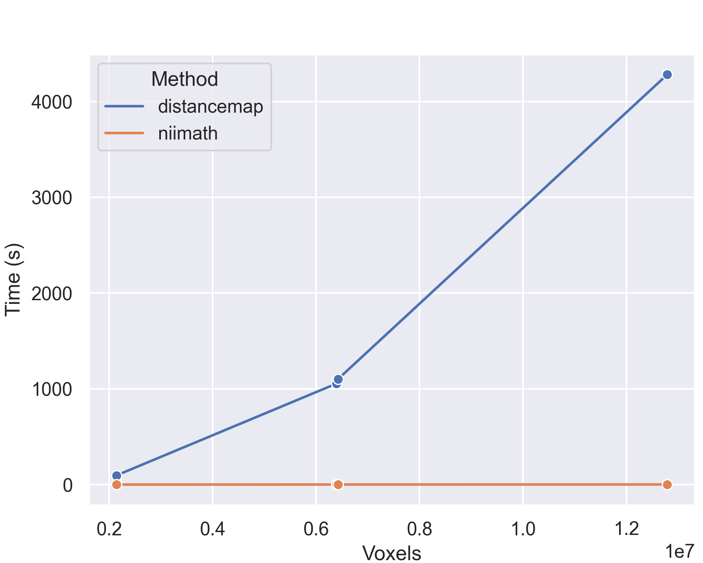
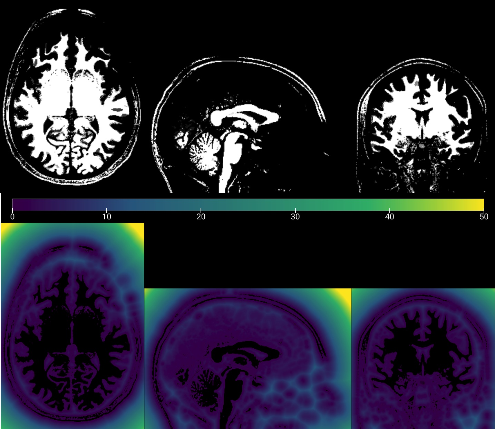

## About

It has been noted that FSL's distancemap is [very slow](https://www.jiscmail.ac.uk/cgi-bin/wa-jisc.exe?A2=ind2112&L=FSL&O=D&X=791227D32119110DFB&Y=rorden%40sc.edu&P=101044). This is unfortunate, as this tool is leveraged by the popular [TBSS](https://fsl.fmrib.ox.ac.uk/fsl/fslwiki/TBSS/UserGuide) and [Bianca](https://fsl.fmrib.ox.ac.uk/fsl/fslwiki/BIANCA/Userguide) pipelines. It computes a Euclidean Distance Transform (EDT) on a binary input image, with the output voxel's intensity reflecting the shortest distance to a bright voxel in the input image. FSL's distancemap was created in [2003](https://github.com/muschellij2/FSL6.0.0/blob/3c3dd651066ee189bc8c290f744ca48cb3d1f156/src/tbss/distancemap.cc), before [Felzenszwalb and Huttenlocher](https://prideout.net/blog/distance_fields/) (2012) popularized the rapid separable solutions. Therefore, distancemap solves the distance map as a 3D operation, rather than three 1D operations. Therefore, distancemap is slow, and gets exponentially slower as image resolution increases.

This repository demonstrates that the separable solution provides as implemented in [niimath](https://github.com/rordenlab/niimath) (v1.0.20211212 and later) is dramatically faster yet provides equivalent results to distancemap. 



## Validation Images

Binary NIfTI format images are provided. The goal is to generate a new image where every voxel encodes the shortest distance to a white voxel. The image below shows an input image (top) and the corresponding EDT image (below).



Four sample NIfTI format binary images are provided. They vary in terms of the number of voxels (allowing us to assess how speed scales with image size) and anisotropy. Anisotrpy refers to the fact that the spatial distance between voxels centers varies between the rows, columns and slices. There are [several solutions](https://github.com/seung-lab/euclidean-distance-transform-3d) to handling this. niimath implements the method of AFNI's thd_euler_dist [scale each input to unity prior](https://github.com/afni/afni/blob/a33c64ef809bb54e7002c52d2206a61722837b94/src/thd_euler_dist.c#L602) to parabola calculation and [subsequently scale back to grid space](https://github.com/afni/afni/blob/a33c64ef809bb54e7002c52d2206a61722837b94/src/thd_euler_dist.c#L634). Unlike AFNI, niimath does not permute the order of slices, rows and columns based on anisotropy. The AFNI code notes that this permute was applied [to avoid pathology in the EDT alg (that miiiight have only existed in earlier calc method, but it still makes sense to do---why not?)](https://github.com/afni/afni/blob/a33c64ef809bb54e7002c52d2206a61722837b94/src/thd_euler_dist.c#L205). The purpose of these validations is to demonstrate that one can get accurate results without this permutation stage.

 - i111 voxels 12792000 dim 208×300×205 pixdim 0.8×0.8×0.8
 - i112 voxels 6427200 dim 208×300×103 pixdim 0.8×0.8×1.6
 - i211 voxels 6396000 dim 104×300×205 pixdim 1.6×0.8×0.8
 - i132 voxels 2142400 dim 208×100×103 pixdim 0.8×2.4×1.6

## Usage

You can compare the time and the results of distancemap and niimath with the following commands:

```
time distancemap -i i132 -o f132
time distancemap -i i112 -o f112
time distancemap -i i211 -o f211
time distancemap -i i111 -o f111
time niimath i132  -binv -edt n132
time niimath i112  -binv -edt n112
time niimath i211  -binv -edt n211
time niimath i111  -binv -edt n111
niimath f132 --compare n132
niimath f112 --compare n112
niimath f211 --compare n211
niimath f111 --compare n111
```

The comparison reveals equivalent results, with the largest difference is 2.47955e-05. See the [identical versus equivalent results](https://github.com/rordenlab/niimath) section of niimath for comments on floating point precision.

## Links

 - [Philip Rideout](https://prideout.net/blog/distance_fields/) elegantly describes the separable solution and includes links for 2D solutions in C, Python and Nim.
 - scipy [`distance_transform_edt`](https://docs.scipy.org/doc/scipy/reference/generated/scipy.ndimage.distance_transform_edt.html) provides a Python implementation (isotropic only).
 - [MLAEDT-3D](https://github.com/seung-lab/euclidean-distance-transform-3d) provides a Python solution that can handle anisotropic data.
 - [Neuroimaging applications](https://github.com/neurolabusc/DistanceFields) for distance maps.
 - Jon Clayden's R-based mmand [includes the distance transform](https://github.com/jonclayden/mmand#the-distance-transform).
